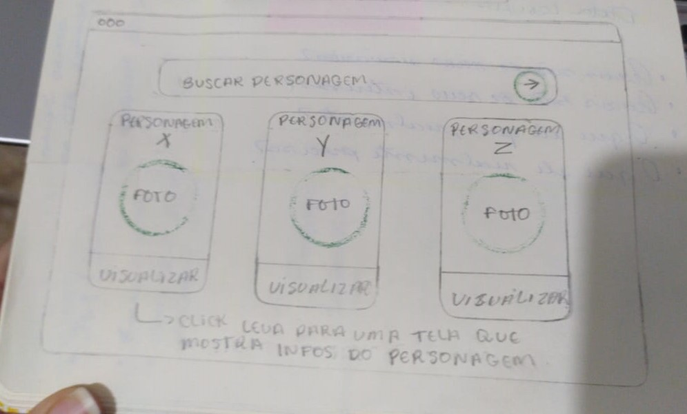

# Rick and Morty :earth_africa: :rocket:
Para acessar o projeto clique [aqui](https://costahadassa.github.io/Rick-and-Morty/)

## Índice
* [índice](#Índice)
* [Sobre o Projeto](#sobre-o-projeto)
* [Objetivos de aprendizagem](#objetivos-de-aprendizagem)
* [História de usuário](*história-de-usuário)
* [Protótipos](*protótipos)
* [Criado por](*Criadoras)

## Sobre o Projeto

O projeto foi desenvolvido para os fãs da série Rick and Morty. 
Criamos uma página web que ofereça uma apresentação dos personagens de acordo com as seguintes informações: nome, espécie, status e origem.

Oferecemos uma página com conteúdo  que satisfaça sua curiosidade e por meio de um design intuitivo e atraente para todos os fãs da série.

## Objetivos de aprendizagem

 * Uso de condicionais (if-else | switch | operador ternário)
 * Uso de laços (for | for..in | for..of | while)
 * Uso de funções (parâmetros | argumentos | valor de retorno)
 * Manipular arrays (filter | map | sort | reduce)
 * Manipular objects (key | value)
 * Uso ES modules (import | export)
 * Diferenciar entre expression e statements.
 * Diferenciar entre tipos de dados atômicos e estruturados.

* Uso de flexbox em CSS.
* Manipular arrays (filter | map | sort | reduce)
* Manipular objects (key | value)
* Uso ES modules (import | export)

## História de usuário

Meu nome é Francesco, tenho 23 anos e sou fã da série Rick e Morty, o desenho me despertou a curiosidade sobre os personagens e as dimensões alternativas. Procurei sites que explicassem detalhes da série mas, não encontrei tantas informações sobre ela.
Gostaria de encontrar um site onde pudesse ter mais de informações relevantes e detalhadas sobre Rick e Morty.
Quero buscar os personagens pelo nome e visualizá-los em cards, com informações como imagem, nome, espécie, gênero, status vivo, morto ou desconhecido.

## Protótipos
___
#### Wireframe do projeto

> Antes da idealização de um protótipo de alto nível seguindo a história do usuário esse foi o primeiro desenho do protótipo.

#### Protótipo de alta fidelidade

>Protótipo do projeto criado utilizando [Figma](https://www.figma.com/file/.7V7DeCV5b64RpHLb9bTceC/Data-Lovers).

## Criadoras
Hadassa Costa [Github](https://github.com/Costahadassa)
Nicaely Joane [Github](https://github.com/Nijoane)
